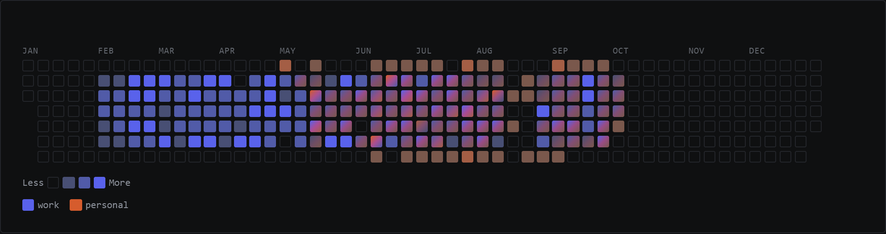

# Hi! I'm Alex, welcome to my GitHub!
## AI-native full-stack developer — Angular + .NET by default
### Currently shipping an Angular front-end and the .NET services behind it

*My own Claude.ai usage, personal and work accounts, rendered by [claude-recap](https://github.com/MckCieply/claude-recap) — a dashboard I built that runs entirely in the browser. Snapshot: October 2026.*

- 🧭 How I grew — I joined each role with one skill and grew into what the team needed next:
  - I came with **Java**; the team needed **Angular** too, so I learned it on the job
  - I came with **Angular**; the next team needed **.NET** too, so I took it on — and now I ship both sides of the stack
  - Then I learned to work **AI-native** — and now I choose only what the problem needs: Angular + .NET by default
- 🔭 Right now I'm working on [claude-recap](https://github.com/MckCieply/claude-recap) and [Investing-Partner](https://github.com/MckCieply/Investing-Partner)
- 🔒 Something big is brewing in private too — stay tuned

- ⚡ Fun fact: I once decided to become a developer and went to create a GitHub account in 2022… turns out I had already done it in 2019 - three years earlier!
